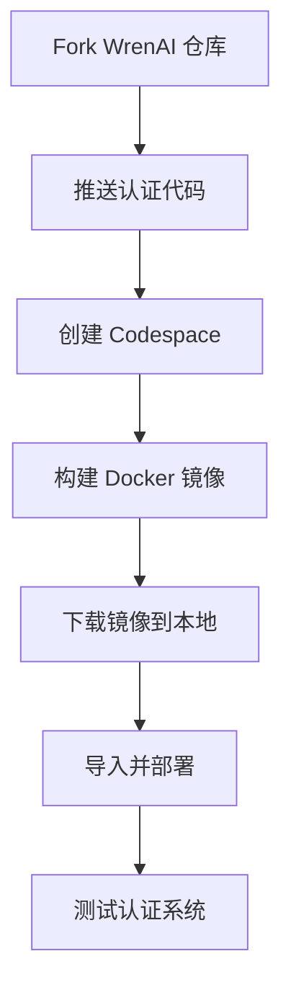

# 使用 GitHub Codespaces 构建 WrenAI 认证系统

## 🎯 为什么选择 Codespaces?

- ✅ **完全免费** - 每月 60 小时免费额度
- ✅ **16GB 内存** - 足够构建需求
- ✅ **无需本地资源** - 云端构建
- ✅ **无需阿里云账号** - 只需 GitHub 账号
- ✅ **浏览器操作** - 无需下载软件

---

## 📋 前提条件

1. GitHub 账号 (您已有: michaelxuswag)
2. Fork WrenAI 仓库到您的账号

---

## 🚀 快速开始 (5 步完成)

### 步骤 1: Fork 仓库

1. 访问: https://github.com/Canner/WrenAI
2. 点击右上角 **"Fork"** 按钮
3. 选择您的账号 `michaelxuswag`
4. 点击 **"Create fork"**

### 步骤 2: 推送认证代码

```bash
# 在本地执行
cd /Users/yuexu/WrenAI

# 修改远程地址为您的 fork
git remote set-url origin https://YOUR_GITHUB_TOKEN@github.com/YOUR_USERNAME/WrenAI.git

# 推送代码
git push origin main
```

### 步骤 3: 启动 Codespaces

1. 访问您的 fork: https://github.com/michaelxuswag/WrenAI
2. 点击绿色的 **"Code"** 按钮
3. 选择 **"Codespaces"** 标签
4. 点击 **"Create codespace on main"**
5. 等待环境启动 (约2-3分钟)

### 步骤 4: 在 Codespaces 中构建

Codespaces 启动后,会打开一个 VSCode 编辑器。在终端中执行:

```bash
# 进入项目目录
cd wren-ui

# 构建 Docker 镜像
docker build -f Dockerfile.auth -t wren-ui-auth:latest .

# 等待构建完成 (约 10-15 分钟)
```

### 步骤 5: 导出镜像到本地

**在 Codespaces 终端中**:
```bash
# 保存镜像
docker save wren-ui-auth:latest | gzip > wren-ui-auth.tar.gz

# 检查文件大小
ls -lh wren-ui-auth.tar.gz
```

**下载到本地**:
1. 在 Codespaces VSCode 左侧,找到 **EXPLORER** (文件浏览器)
2. 找到 `wren-ui/wren-ui-auth.tar.gz`
3. 右键 → **Download**
4. 保存到 `/Users/yuexu/`

**在本地导入镜像**:
```bash
cd /Users/yuexu
docker load < wren-ui-auth.tar.gz

# 验证镜像
docker images | grep wren-ui-auth
```

---

## 🎉 部署和测试

```bash
# 更新 docker-compose.yaml
cd /Users/yuexu/WrenAI/docker

# 编辑 docker-compose.yaml,修改 wren-ui 的 image:
#   image: wren-ui-auth:latest

# 重启服务
docker-compose up -d

# 测试认证 API
cd /Users/yuexu/WrenAI/wren-ui
./test-auth-api.sh
```

---

## 💡 Codespaces 使用提示

### 免费额度
- **个人账号**: 每月 60 小时
- **2核 8GB**: 120 小时/月
- **4核 16GB**: 60 小时/月 (我们用这个)

### 费用计算
- 构建时间: 约 15-20 分钟
- 使用额度: 0.33 小时
- **完全在免费额度内**

### 停止 Codespaces
构建完成后,记得停止以节省额度:
1. 访问: https://github.com/codespaces
2. 找到您的 Codespace
3. 点击 **"..."** → **"Stop codespace"**

---

## 🔧 故障排查

### 问题 1: Codespaces 无法启动

**解决**: 确保您的 GitHub 账号已验证邮箱

### 问题 2: Docker 构建失败

**解决**: Codespaces 默认有 16GB 内存,应该足够。检查构建日志。

### 问题 3: 文件下载失败

**方案 A**: 使用 Codespaces 的 "Download" 功能
**方案 B**: 推送镜像到 GitHub Container Registry:
```bash
# 在 Codespaces 中
docker tag wren-ui-auth:latest ghcr.io/michaelxuswag/wren-ui-auth:latest
echo $GITHUB_TOKEN | docker login ghcr.io -u michaelxuswag --password-stdin
docker push ghcr.io/michaelxuswag/wren-ui-auth:latest

# 本地拉取
docker pull ghcr.io/michaelxuswag/wren-ui-auth:latest
docker tag ghcr.io/michaelxuswag/wren-ui-auth:latest wren-ui-auth:latest
```

---

## 📊 方案对比

| 方案 | 时间 | 成本 | 难度 | 推荐度 |
|------|------|------|------|--------|
| **Codespaces** | 20分钟 | 免费 | ⭐ 简单 | ⭐⭐⭐⭐⭐ |
| 阿里云 ECS | 20分钟 | 1-2元 | ⭐⭐ 中等 | ⭐⭐⭐⭐ |
| 增加本地内存 | 15分钟 | 免费 | ⭐⭐⭐ 较难 | ⭐⭐⭐ |

---

## 🎯 推荐流程



---

## 📞 获取帮助

如果遇到问题:
1. 检查 Codespaces 是否有足够的免费额度
2. 确认 fork 的仓库包含所有认证代码
3. 查看 Docker 构建日志

---

**开始构建吧!** 🚀

**总耗时**: 约 20-30 分钟
**总成本**: ¥0 (完全免费)
