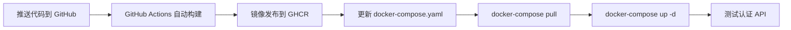

# GitHub Actions 构建指南

由于本地 Docker Desktop 内存限制(7.65GB < 12GB 要求),无法在本地完成 Docker 镜像构建。

本指南将帮助您使用 **GitHub Actions** 在云端构建 Docker 镜像(免费,自动,有 7GB+ 内存)。

---

## 📋 前提条件

1. **GitHub 仓库**: 将 WrenAI 代码推送到 GitHub
2. **启用 GitHub Packages**: 默认已启用,用于存储 Docker 镜像

---

## 🚀 快速开始 (3 步完成)

### 步骤 1: 推送代码到 GitHub

```bash
cd /Users/yuexu/WrenAI

# 初始化 git (如果还没有)
git init
git add .
git commit -m "Add WrenAI authentication system

- Database migrations (9 files)
- Backend auth services
- Frontend login/register pages
- JWT + RBAC system
- 3 roles, 33 permissions

🤖 Generated with Claude Code"

# 添加 GitHub 远程仓库 (替换成您的仓库地址)
git remote add origin https://github.com/YOUR_USERNAME/WrenAI.git

# 推送代码
git push -u origin main
```

**如果 git 仓库已存在,只需推送:**

```bash
cd /Users/yuexu/WrenAI
git add .
git commit -m "Add authentication system with GitHub Actions workflow"
git push
```

### 步骤 2: GitHub Actions 自动构建

推送后,GitHub Actions 会自动触发构建:

1. 访问: `https://github.com/YOUR_USERNAME/WrenAI/actions`
2. 查看 "Build WrenAI Auth Docker Image" 工作流
3. 等待构建完成(大约 10-15 分钟)

**手动触发构建**:
- 进入 Actions 标签页
- 选择 "Build WrenAI Auth Docker Image"
- 点击 "Run workflow" → "Run workflow"

### 步骤 3: 使用构建好的镜像

构建完成后,镜像会发布到 GitHub Container Registry:

```bash
# 镜像地址格式
ghcr.io/YOUR_USERNAME/wren-ui-auth:latest
```

**更新您的 docker-compose.yaml**:

```yaml
# /Users/yuexu/WrenAI/docker/docker-compose.yaml

services:
  wren-ui:
    # 修改这一行 ⬇️
    image: ghcr.io/YOUR_USERNAME/wren-ui-auth:latest

    # 如果镜像是私有的,需要先登录
    # docker login ghcr.io -u YOUR_USERNAME -p YOUR_GITHUB_TOKEN

    # 其他配置保持不变...
    ports:
      - "3000:3000"
    environment:
      # ... 现有环境变量
```

**拉取并重启服务**:

```bash
cd /Users/yuexu/WrenAI/docker

# 拉取新镜像
docker-compose pull wren-ui

# 重启服务
docker-compose up -d

# 查看日志
docker-compose logs -f wren-ui
```

---

## 🔐 配置 GitHub Token (如果镜像是私有的)

如果您的 GitHub 仓库是私有的,Docker 镜像也会是私有的。

### 创建 Personal Access Token (PAT)

1. 访问: https://github.com/settings/tokens
2. 点击 **"Generate new token"** → **"Classic"**
3. 权限勾选:
   - ✅ `read:packages` (读取容器镜像)
   - ✅ `write:packages` (如需推送)
4. 生成并复制 token

### 登录 GitHub Container Registry

```bash
# 使用 token 登录
docker login ghcr.io -u YOUR_USERNAME -p YOUR_GITHUB_TOKEN

# 示例
docker login ghcr.io -u wrenai-user -p ghp_xxxxxxxxxxxx
```

### 在 Docker Compose 中使用私有镜像

```bash
# 先登录
docker login ghcr.io -u YOUR_USERNAME -p YOUR_GITHUB_TOKEN

# 然后拉取
docker-compose pull wren-ui

# 启动
docker-compose up -d
```

---

## 📊 监控构建过程

### 查看构建日志

1. 进入 GitHub 仓库
2. 点击 **Actions** 标签
3. 选择最新的工作流运行
4. 点击 "build" 作业
5. 展开步骤查看详细日志

### 构建成功标志

```
✅ Docker image built successfully!

📦 Image tags:
ghcr.io/YOUR_USERNAME/wren-ui-auth:latest
ghcr.io/YOUR_USERNAME/wren-ui-auth:main-sha-abc1234

🚀 Next steps:
1. Update your docker-compose.yaml to use: ghcr.io/YOUR_USERNAME/wren-ui-auth:latest
2. Run: docker-compose pull && docker-compose up -d
3. Test authentication: http://localhost:3000/api/graphql
```

---

## 🧪 测试认证系统

镜像部署后,使用测试脚本验证:

```bash
cd /Users/yuexu/WrenAI/wren-ui
./test-auth-api.sh
```

或手动测试 GraphQL API:

```bash
# 1. 注册用户
curl -X POST http://localhost:3000/api/graphql \
  -H 'Content-Type: application/json' \
  -d '{
    "query": "mutation { register(email: \"admin@example.com\", username: \"admin\", password: \"Admin123456\", fullName: \"管理员\", organizationName: \"我的公司\") { user { id email username } accessToken } }"
  }'

# 2. 登录
curl -X POST http://localhost:3000/api/graphql \
  -H 'Content-Type: application/json' \
  -d '{
    "query": "mutation { login(email: \"admin@example.com\", password: \"Admin123456\") { accessToken user { id email username } } }"
  }'
```

---

## 🔧 故障排查

### 问题 1: Actions 权限错误

**错误**: `denied: permission_denied: write_package`

**解决方案**:
1. 进入仓库 Settings → Actions → General
2. 滚动到 "Workflow permissions"
3. 选择 **"Read and write permissions"**
4. 保存并重新运行工作流

### 问题 2: 构建失败 - 内存不足

**GitHub Actions 提供的内存**: 7GB (通常足够)

**如果仍然失败**:
- 使用 GitHub Actions 的大型运行器(付费)
- 或使用云服务器(阿里云/AWS)构建

### 问题 3: 无法拉取私有镜像

**错误**: `unauthorized: authentication required`

**解决方案**:
```bash
# 确保已登录
docker login ghcr.io -u YOUR_USERNAME

# 检查 token 权限
# 确保 PAT 包含 read:packages 权限
```

### 问题 4: docker-compose 启动失败

**检查日志**:
```bash
docker-compose logs wren-ui

# 查看详细错误
docker inspect wrenai-wren-ui-1
```

---

## 🎯 完整工作流程总结



**命令总结**:

```bash
# 1. 推送代码
cd /Users/yuexu/WrenAI
git add .
git commit -m "Add auth system"
git push

# 2. 等待 GitHub Actions 构建完成(访问 GitHub Actions 页面查看)

# 3. 更新 docker-compose.yaml (修改 image 字段)

# 4. 部署新镜像
cd /Users/yuexu/WrenAI/docker
docker-compose pull wren-ui
docker-compose up -d

# 5. 测试
cd /Users/yuexu/WrenAI/wren-ui
./test-auth-api.sh
```

---

## 💰 成本说明

**GitHub Actions (推荐)**:
- ✅ **公开仓库**: 完全免费,无限分钟
- ⚠️ **私有仓库**: 每月 2000 分钟免费 (约可构建 100+ 次)

**存储**:
- ✅ **公开镜像**: 免费,无限存储
- ⚠️ **私有镜像**: 500MB 免费,超出后 $0.25/GB/月

**对于 WrenAI 项目**:
- 镜像大小: 约 500MB-1GB
- 构建时间: 10-15 分钟
- **建议**: 使用公开仓库或私有仓库免费额度

---

## 📞 获取帮助

如果构建失败,请:

1. **查看 GitHub Actions 日志**
2. **检查 Dockerfile.auth 语法**
3. **验证依赖包版本**
4. **查看完整文档**: [AUTH_DEPLOYMENT_GUIDE.md](AUTH_DEPLOYMENT_GUIDE.md)

---

**创建时间**: 2025-01-24
**用途**: 解决本地 Docker 内存限制问题
**优势**: 免费、自动、可靠、7GB 内存

